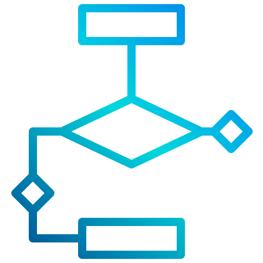

# Tasker: Queable Multi-Step Tasks Made Easy-ish

## *Designed to make developing queuable multi-step tasks easier to reason about*

## Purpose

In event-driven architectures, it is not uncommon for the successful completion of any single Task to actually be dependent on Steps taken with respect multiple disparate systems. These systems can be SaaS platforms, in-house developed microservices, data stores, other event queues, and the like. It is very common for a Task to need to interact with many systems at once before it can be determined to be successfully complate - consider an ecommerce system and a fulfillment system. When a change should be made to one, very frequently that change should, in some manner, propagate to both. Or, similarly, when an order is shipped, perhaps final taxes need to be calculated and reported to a tax SaaS platform, have the response data stored, and finally in total synced to a datawarehouse for financial consistency. The purpose of Tasker is to make it more straightforward to enable event-driven architectures to handle multi-step tasks in a consistent and predictable way, with exposure to visibility in terms of results, status of steps, retryability, timeouts and backoffs, etc.

This kind of system is of course fairly specialized - it is not every organization that needs queuable multi-step task architectures. But when that need arises it makes it far easier to have a standardized way of handling these things.

The core concept of Tasker is, well, the `Task`. Conceptually, most important attributes of a `Task` are the `name` and the `context` - the `name` is a specific identifier to denote which configured `TaskHandler` is responsible for processing the `Task`. The `context` is a somewhat arbitrary, but validatable within the `TaskHandler`, data structure representing the necessary inputs for the `WorkflowStep`s that are expected to resolve the `Task`.

The second most important concept is the `WorkflowStep` - a `Task` has many `WorkflowStep`s. These can be independent, which means that they will be run without respect to the order of any other step, or they can be dependent on any other step. It is not uncommon in complex systems that one step may call a SaaS or microservice API, and the results of that call can be used as the inputs to the dependent step. The purpose of Tasker is to make defining these steps, their handlers, and their relationships as straightforward as possible.

The extension of the system relies on building classes that include the `TaskHandler::HandlerCommon` module, and extend the necessary methods. A review of a mock [DummyTask](./spec/mocks/dummy_task.rb) can potentially make this clearer - registering `StepTemplate`s allows a clean way to express `WorkflowStep` relationships and handler logic.

## Dependencies

* Ruby version - 2.7.3

* System dependencies - Redis and Sidekiq

* Database - `bundle exec rake db:schema:load`

* How to run the test suite - `bundle exec rspec spec`

* Services - Sidekiq

## Rust and Ruby-FFI

A sample TaskHandler for a WorkflowStep has been implemented in Rust using Ruby-FFI.

Check out the [crate](./crates/dummy_rust_task_handler). To rebuild the gem for test on your own system, do this:

`cd crates/dummy_rust_task_handler; rake clean && rake build`

Of course this assumes you have [Rust installed](https://www.rust-lang.org/tools/install).

## Gratitude

Flowchart PNG by [xnimrodx](https://www.flaticon.com/authors/xnimrodx) from [Flaticon](https://www.flaticon.com/) 